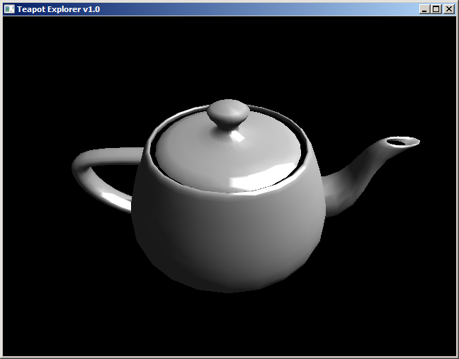

# Tramway SDK Template Project

The Tramway SDK framework is constructed as a C++ library, so in order to use it
you need an application to embed it in. This is such an application and a very
minimalistic application at that.

After downloading the repository you can either use it as a base for your C++
project, or you can use it for doing Lua scripting.



# Downloading

Compiled binaries for Windows 64-bit are available for this template in the 
latest [Tramway SDK](https://github.com/racenis/tram-sdk/releases/tag/v0.1.1)
release.

# Building

The easiest way to build the template would be to run CMake. Make sure that you
have CMake and a C++20 compiler installed. Then run the `cmake` command to
generate the build files for your toolchain.

The CMake script will automatically download and compile all of the
dependencies. If you are using Windows, you won't need anything extra, but on
Linux you might need to install additional dependencies (for OpenGL and X11
development).
 
For Debian/Ubuntu systems you can try running
```
sudo apt-get install libmesa-dev
sudo apt-get install xorg-dev
```
For Fedora based systems try running
```
sudo dnf install mesa-libGL-devel libXcursor-devel libXi-devel libXinerama-devel libXrandr-devel
```